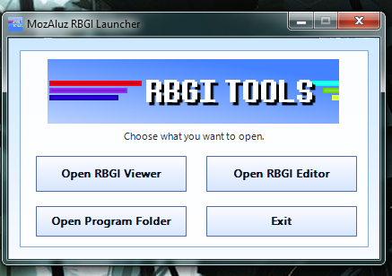
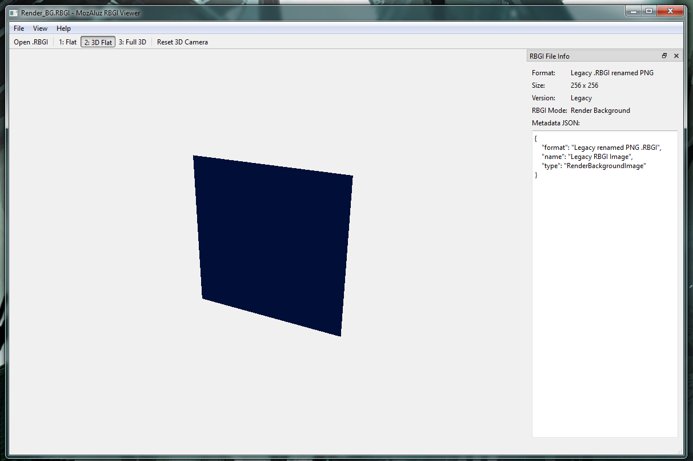
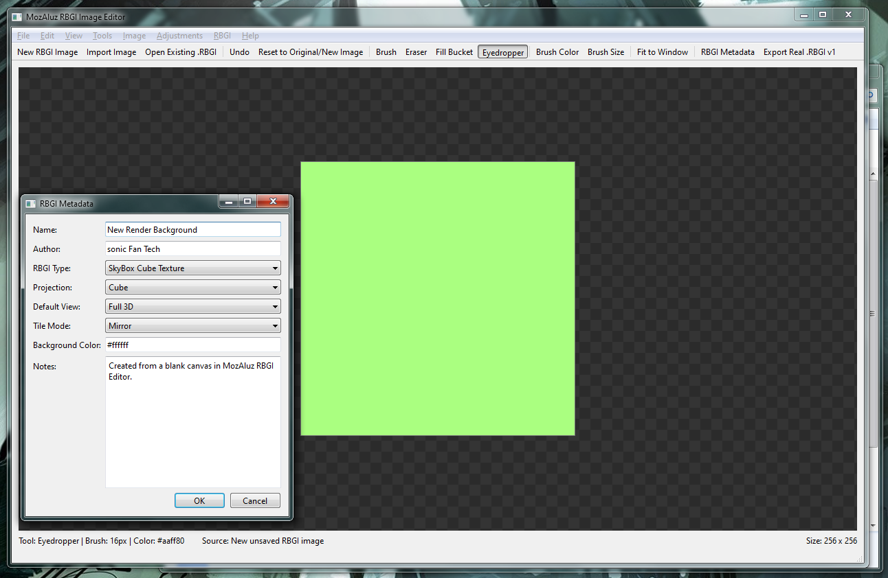

<p align="center">
  
</p>

<h1 align="center">MozAluz RBGI Tools</h1>

<p align="center">
  A small Windows toolset for creating, editing, viewing, and testing custom <strong>.RBGI</strong> render background / SkyBox image files.
</p>

<p align="center">
  <a href="https://github.com/sonicFanTech/MozAluz-RBGITOOLS/releases/download/v1/MozAluz_RBGI_TOOLS_V1.0.0.7z"><strong>Download v1.0.0</strong></a>
  ·
  <a href="https://github.com/sonicFanTech/MozAluz-RBGITOOLS/releases">Releases</a>
</p>

---

## What is MozAluz RBGI Tools?

**MozAluz RBGI Tools** is a Windows utility package made for working with **`.RBGI`** files.

`.RBGI` stands for:

```txt
Render Background Image
```

The format is meant for custom render backgrounds, OpenGL preview backgrounds, 3D viewport backgrounds, and simple SkyBox-style image workflows. The idea started as a custom background image format for render tabs, especially for projects that need a small special-purpose image file instead of using a normal `.png` directly.

The toolset includes:

| Program | Purpose |
|---|---|
| **MozAluz RBGI Launcher** | Small Win32 launcher that lets you open the Viewer or Editor |
| **MozAluz RBGI Viewer** | Opens and previews `.RBGI` files in flat and 3D view modes |
| **MozAluz RBGI Editor** | Creates and edits `.RBGI` files with basic Paint.NET-style image tools |
| **SharedRBGIformat.dll** | Shared RBGI format library used by both the Viewer and Editor |

---

## Download

Latest pre-compiled Windows build:

**[Download MozAluz RBGI Tools v1.0.0](https://github.com/sonicFanTech/MozAluz-RBGITOOLS/releases/download/v1/MozAluz_RBGI_TOOLS_V1.0.0.7z)**

After downloading:

1. Extract the `.7z` file.
2. Open the extracted folder.
3. Run:

```txt
MozAluz_RBGI_Launcher.exe
```

The launcher lets you choose whether to open the Viewer or the Editor.

---

## Screenshots

### MozAluz RBGI Launcher

<p align="center">
  
</p>

The launcher is a small Win32 program that opens the main tools. It does not require Qt itself, but the Viewer and Editor do.

### MozAluz RBGI Viewer

<p align="center">
  
</p>

The Viewer can display `.RBGI` files normally or through OpenGL preview modes.

### MozAluz RBGI Editor

<p align="center">
  
</p>

The Editor can create new `.RBGI` files, import images, edit basic colors/effects, and save real RBGI v1 files.

---

## What is an RBGI file?

An `.RBGI` file is a custom image file type made for render background and SkyBox workflows.

Early `.RBGI` files were just renamed PNG files:

```txt
.RBGI = PNG file with a custom extension
```

That still works, and the Viewer/Editor can still open those legacy renamed-PNG `.RBGI` files.

The newer format is **RBGI v1**, which is a custom container that stores image data plus metadata.

### RBGI v1 container idea

```txt
RBGI File Format v1

Magic:      RBGI
Version:    1
Metadata:   JSON
Image Data: PNG bytes
Use Case:   Render background / SkyBox / OpenGL preview image
```

The PNG data is still stored inside the file, so it stays easy to decode, but the file itself can also store custom RBGI information.

---

## RBGI metadata

Real RBGI v1 files can include metadata such as:

```json
{
  "format": "RBGI v1",
  "name": "New Render Background",
  "author": "sonic Fan Tech",
  "type": "RenderBackgroundImage",
  "projection": "Flat",
  "defaultView": "Full 3D",
  "tileMode": "Clamp",
  "backgroundColor": "#ffffff",
  "notes": "Created from a blank canvas in MozAluz RBGI Editor."
}
```

This makes `.RBGI` more useful than a normal PNG because programs can understand what the image is meant to be used for.

For example, another program could load the metadata and know:

```txt
This is a render background.
Default view mode should be Full 3D.
Tile mode should be Clamp.
The image is meant for SkyBox / preview rendering.
```

---

## Included programs

## MozAluz RBGI Launcher

The launcher is the first program users normally open.

It provides quick buttons for:

- Opening **MozAluz RBGI Viewer**
- Opening **MozAluz RBGI Editor**
- Opening the program folder
- Exiting the launcher

The launcher uses a Win32 GUI and includes the custom RBGI Tools banner/logo style.

Expected executable:

```txt
MozAluz_RBGI_Launcher.exe
```

---

## MozAluz RBGI Viewer

The Viewer is used for opening and previewing `.RBGI` files.

Supported file types:

```txt
.RBGI
```

Supported RBGI types:

- Legacy renamed-PNG `.RBGI`
- Real RBGI v1 files with metadata

### Viewer modes

The Viewer includes three view modes:

| Mode | Description |
|---|---|
| **Flat** | Normal 2D image viewing, like a standard image viewer |
| **3D Flat** | Shows the image as a flat plane in a 3D OpenGL viewport |
| **Full 3D** | Shows the image on a simple 3D cube-style preview |

### Viewer controls

The 3D modes support:

- Mouse drag rotation
- Zoom controls
- Reset 3D camera

This makes it easier to preview how a render background or SkyBox-style texture might look in a basic 3D space.

### File info panel

The Viewer also shows RBGI file information, including:

- Format
- Size
- Version
- RBGI mode
- Metadata JSON

---

## MozAluz RBGI Editor

The Editor is used for creating and editing `.RBGI` files.

It is designed to feel more like a basic image editor, with Paint.NET-style menus and tools.

Expected executable:

```txt
MozAluz_RBGI_Editor.exe
```

### Create new RBGI images

The Editor can create brand-new blank `.RBGI` images.

You can choose:

- Image width
- Image height
- Starting background color
- RBGI type
- Metadata values

This means you do not have to start from an existing PNG file.

### Import existing images

The Editor can import normal image files and turn them into `.RBGI` files.

Supported import types may include:

```txt
PNG
JPG / JPEG
BMP
WEBP
```

Actual support depends on the image formats available through Qt on the system/build.

### Open existing RBGI files

The Editor can open:

- Legacy renamed-PNG `.RBGI` files
- Real RBGI v1 files

### Export options

The Editor can export:

- Real `.RBGI v1`
- Legacy renamed-PNG `.RBGI`

The real `.RBGI v1` export is the recommended format going forward.

---

## Editor tools

The Editor currently includes basic editing tools:

| Tool | Purpose |
|---|---|
| **Brush** | Draws on the image |
| **Eraser** | Erases pixels / paints transparency or background depending on image mode |
| **Fill Bucket** | Fills an area with the selected color |
| **Eyedropper** | Picks a color from the image |
| **Brush Color** | Opens a color picker |
| **Brush Size** | Changes brush size |
| **Undo** | Reverts the last edit |
| **Reset** | Restores the original imported/new image |
| **Fit to Window** | Fits the canvas into the editor view |

---

## Image editing features

The Editor includes basic image adjustments:

- Rotate left
- Rotate right
- Flip horizontal
- Flip vertical
- Grayscale
- Invert
- Sepia
- Tint
- Brightness
- Contrast
- Saturation
- Posterize / shade levels
- Resize image
- Resize canvas

These tools are not meant to replace a full professional editor yet, but they are useful enough for making and adjusting render background images.

---

## RBGI metadata editor

The Editor includes an RBGI metadata window.

Metadata fields include:

| Field | Description |
|---|---|
| **Name** | Display name for the RBGI image |
| **Author** | Creator name |
| **RBGI Type** | Render background, SkyBox texture, etc. |
| **Projection** | Flat, Cube, or other projection idea |
| **Default View** | Suggested Viewer mode |
| **Tile Mode** | Clamp, Repeat, Mirror, etc. |
| **Background Color** | Suggested background color |
| **Notes** | Extra notes about the image |

This metadata is saved into real RBGI v1 files.

---

## SharedRBGIformat.dll

`SharedRBGIformat.dll` is the shared library used by both the Viewer and Editor.

Expected file:

```txt
SharedRBGIformat.dll
```

It handles the shared RBGI file format logic, so the Viewer and Editor do not need to each carry their own separate copy of the RBGI format code.

This helps keep the RBGI format behavior consistent across the tools.

### Why a shared DLL?

Using a shared DLL makes the toolset cleaner:

- Viewer and Editor use the same RBGI read/write logic.
- Future format updates can be handled in one shared place.
- The RBGI format can later be reused by other programs.
- It makes the toolset feel more like a proper Windows software package.

---

## Folder layout

A normal extracted build should look something like this:

```txt
MozAluz RBGI Tools/
│
├─ MozAluz_RBGI_Launcher.exe
├─ MozAluz_RBGI_Viewer.exe
├─ MozAluz_RBGI_Editor.exe
├─ SharedRBGIformat.dll
│
├─ Qt6Core.dll
├─ Qt6Gui.dll
├─ Qt6Widgets.dll
├─ Qt6OpenGL.dll
├─ Qt6OpenGLWidgets.dll
│
├─ platforms/
├─ imageformats/
├─ styles/
│
└─ other Qt runtime files...
```

The exact Qt runtime files may vary depending on the build.

---

## System requirements

Recommended:

| Requirement | Details |
|---|---|
| OS | Windows 10 or Windows 11 |
| Architecture | x64 |
| Graphics | Basic OpenGL support |
| Runtime | Included in pre-compiled build if properly deployed |
| Disk Space | Small; depends mostly on Qt runtime files |

The Viewer and Editor use Qt 6, so the pre-compiled build includes the needed Qt runtime files.

---

## How to use

## Opening the tools

Run:

```txt
MozAluz_RBGI_Launcher.exe
```

Then choose:

- **Open RBGI Viewer**
- **Open RBGI Editor**

---

## Creating a new RBGI file

1. Open **MozAluz RBGI Editor**.
2. Click **New RBGI Image**.
3. Choose the size and starting background color.
4. Draw or edit the image.
5. Open **RBGI Metadata**.
6. Fill out the metadata.
7. Click **Export Real .RBGI v1**.

---

## Editing an existing RBGI file

1. Open **MozAluz RBGI Editor**.
2. Click **Open Existing .RBGI**.
3. Pick a `.RBGI` file.
4. Edit the image.
5. Update metadata if needed.
6. Export the file again.

---

## Viewing an RBGI file

1. Open **MozAluz RBGI Viewer**.
2. Click **Open .RBGI**.
3. Choose a `.RBGI` file.
4. Use one of the view modes:
   - Flat
   - 3D Flat
   - Full 3D

---

## Legacy `.RBGI` support

Legacy `.RBGI` files are just PNG images with the `.RBGI` file extension.

Example:

```txt
Render_BG.png
```

renamed to:

```txt
Render_BG.RBGI
```

MozAluz RBGI Tools still supports these files.

However, real RBGI v1 files are recommended because they support metadata.

---

## Real RBGI v1 vs legacy renamed PNG

| Feature | Legacy renamed PNG `.RBGI` | Real RBGI v1 |
|---|---:|---:|
| Opens in Viewer | Yes | Yes |
| Opens in Editor | Yes | Yes |
| Contains PNG image data | Yes | Yes |
| Has RBGI metadata | No | Yes |
| Has format version | No | Yes |
| Better for future tools | No | Yes |
| Recommended for new files | No | Yes |

---

## Possible use cases

MozAluz RBGI Tools can be useful for:

- Render tab backgrounds
- OpenGL preview backgrounds
- SkyBox testing
- Simple game/editor background images
- Custom tool background textures
- Source Engine / BSP viewer preview backgrounds
- Creating small custom image assets for development tools

---

## Current limitations

Version 1.0.0 is still a basic first public version.

Current limitations:

- The Editor is not a full replacement for Paint.NET, GIMP, Photoshop, or Krita.
- Layer support is not included yet.
- Selection tools are basic or not included yet.
- Advanced filters are not included yet.
- Real cube-map / six-face SkyBox editing is not fully implemented yet.
- RBGI v1 is still early and may expand later.
- File association / double-click opening may need to be added separately through an installer.

---

## Roadmap / future ideas

Possible future features:

- Layer support
- Selection tools
- Magic wand selection
- Rectangle / ellipse selection
- Crop tool
- Text tool
- Line / shape tools
- Gradient tool
- Better zoom/pan controls
- Recent files
- File association for `.RBGI`
- Windows installer
- More detailed RBGI metadata
- RBGI thumbnails / shell preview support
- Real six-sided SkyBox support
- Cube-map export/import
- More Viewer render modes
- Checkerboard customization
- Plugin system for filters
- Better theme support
- Full image editor mode
- Integration with other sonic Fan Tech tools

---

## About the name

**RBGI** stands for:

```txt
Render Background Image
```

The format was created to give render backgrounds and SkyBox-style images their own dedicated file type.

**MozAluz RBGI Tools** is the software package for working with that format.

---

## Project status

Current version:

```txt
v1.0.0
```

Current build type:

```txt
Pre-compiled Windows x64 build
```

Main release file:

```txt
MozAluz_RBGI_TOOLS_V1.0.0.7z
```

---

## Credits

Created by:

```txt
sonic Fan Tech
```

Custom banner and logo created by sonic Fan Tech.

Built with:

- C++
- Qt 6
- Win32 API
- OpenGL
- Visual Studio / MSVC

---

## Notes

MozAluz RBGI Tools is a custom utility project for working with `.RBGI` files. It is not an official image standard and is not meant to replace common image formats like PNG, JPG, or BMP.

The recommended workflow is:

```txt
Use PNG/JPG/BMP/WEBP for normal images.
Use RBGI for render backgrounds, SkyBox textures, and custom preview-background assets.
```

---

## Repository

GitHub repository:

```txt
https://github.com/sonicFanTech/MozAluz-RBGITOOLS
```

Latest release download:

```txt
https://github.com/sonicFanTech/MozAluz-RBGITOOLS/releases/download/v1/MozAluz_RBGI_TOOLS_V1.0.0.7z
```
